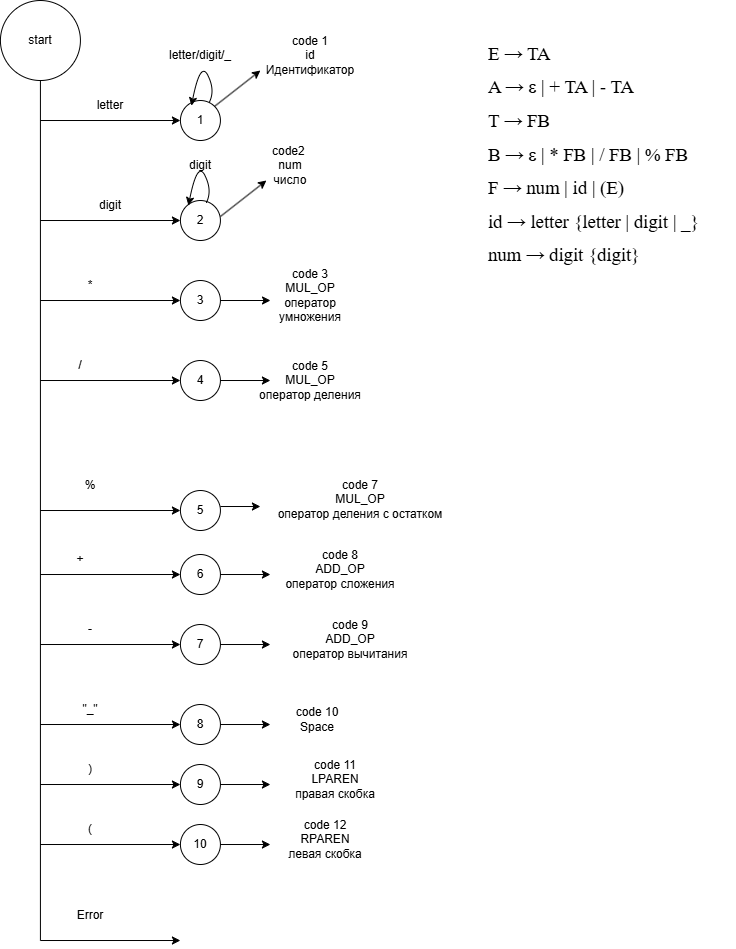
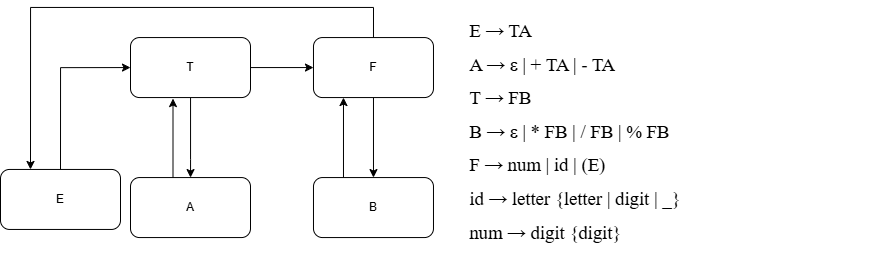

# Лабораторная работа 6. Создание внутренней формы представления программы


## Вариант задания

### Язык
Арифметические выражения (идентификаторы, целые числа, операции `+ - * / %`, скобки).

### Полное определение КС-грамматики

```
E → TA
A → ε | + TA | - TA
T → FB
B → ε | * FB | / FB | % FB
F → num | id | (E)

id → letter {letter | digit | _}
num → digit {digit}
```

### Примеры верных строк

- `1+2*3`
- `(1+2)*3`
- `a1 + b_2 * (c - 10) % 7`
- `x`
- `12345`

## Описание работы

### Цель работы
Изучить методы построения внутреннего представления программы (ВПП) на основе КС-грамматики, реализовать синтаксический анализатор методом рекурсивного спуска и преобразовать арифметические выражения в тетрады и ПОЛИЗ.

### Постановка задачи

- Реализовать поиск **лексических** и **синтаксических** ошибок для заданной КС-грамматики методом рекурсивного спуска.
- Представить внутреннюю форму программы в виде **тетрад** `(op, arg1, arg2, result)` для арифметических выражений (**только для корректных строк**).
- Преобразовать выражение в **ПОЛИЗ** (польскую инверсную запись) и вычислить его значение (**только арифметическое выражение из целых чисел**).


Реализованы:

1. **Лексический анализ**
   - выделение `id`, `num`, операторов `+ - * / %`, скобок;
   - фиксация лексических ошибок:
     - недопустимый символ;
     - недопустимый идентификатор, начинающийся с `_` (по правилу `id → letter ...`).

2. **Синтаксический анализ (рекурсивный спуск)**
   - функции соответствуют правилам грамматики: `E`, `A`, `T`, `B`, `F`;
   - фиксируются синтаксические ошибки:
     - пропущенный операнд;
     - лишняя закрывающая скобка;
     - пропущенная закрывающая скобка;
     - лишние символы после корректного выражения.

3. **Внутреннее представление в виде тетрад**
   - при успешном синтаксическом разборе генерируются тетрады вида `(op, arg1, arg2, result)`;
   - используются временные переменные `t1`, `t2`, ...

4. **ПОЛИЗ и вычисление**
   - ПОЛИЗ строится алгоритмом Дейкстры (shunting-yard);
   - приоритет операций: `* / %`, затем `+ -`;
   - вычисление выполняется **только для выражений из целых чисел** (без `id`).

## Диаграмма лексера (текстовая схема)

```
START
  |-- digit --------> NUM (digit*)
  |-- letter -------> ID  (letter|digit|_)*
  |-- '_' ----------> LEX_ERROR (id должен начинаться с буквы)
  |-- '+' '-' '*' '/' '%' -> OP
  |-- '(' ----------> LPAREN
  |-- ')' ----------> RPAREN
  |-- whitespace ---> skip
  '-- other --------> LEX_ERROR
```

## Схема рекурсивного спуска для парсера

```
parse:
  E
  expect EOF

E:
  T
  A

A:
  if '+' or '-':
     T
     emit quad
     A
  else eps

T:
  F
  B

B:
  if '*', '/', '%':
     F
     emit quad
     B
  else eps

F:
  num | id | '(' E ')'
```




## Тестовые примеры 


