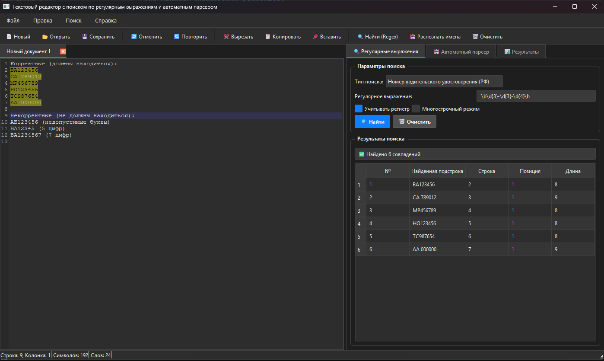
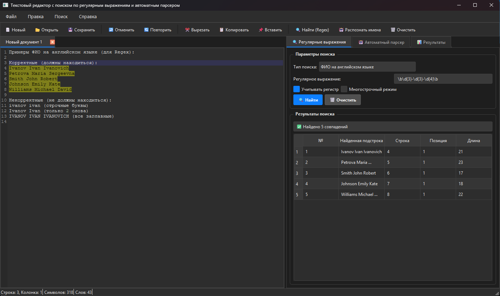
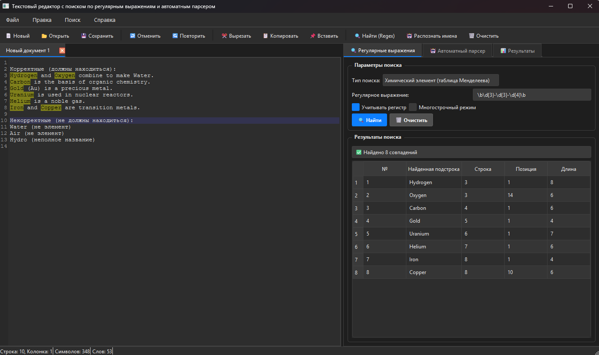
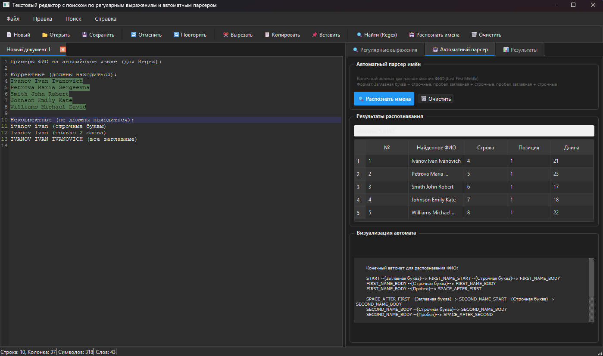
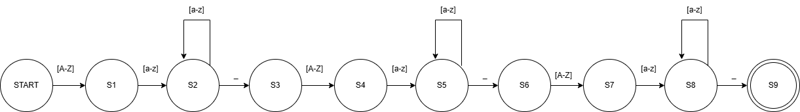

# Лабораторная работа 4. Реализация алгоритма поиска подстрок с помощью регулярных выражений

## Цель работы
Изучить теоретические основы регулярных выражений и их применение для поиска и извлечения подстрок из текста. Освоить практические навыки использования библиотечных средств работы с регулярными выражениями, а также интеграцию алгоритмов поиска в графический интерфейс приложения.

### Постановка задачи
Разработать модуль поиска подстрок с использованием регулярных выражений, интегрировать его в существующее приложение (текстовый редактор) и обеспечить наглядный вывод результатов.


## Регулярное выражение, описывающее номер водительского удостоверения (в России)

```
\b[АВЕКМНОРСТУХ]{2}\s?\d{6}\b
```
### Примеры номеров водительских удостоверений РФ:

```
Корректные (должны находиться):
ВА123456
СА 789012
МР456789
НО123456
ТС987654
АА 000000

Некорректные (не должны находиться):
АБ123456 (недопустимые буквы)
ВА12345 (5 цифр)
ВА1234567 (7 цифр)
```

## Регулярное выражение, описывающее ФИО человека на английском языке (Last Name, First Name Middle Name).

```
[A-Z][a-z]+[ \t]+[A-Z][a-z]+[ \t]+[A-Z][a-z]+
```
### Примеры строк

```
Корректные (должны находиться):
Ivanov Ivan Ivanovich
Petrova Maria Sergeevna
Smith John Robert
Johnson Emily Kate
Williams Michael David

Некорректные (не должны находиться):
ivanov ivan (строчные буквы)
Ivanov Ivan (только 2 слова)
IVANOV IVAN IVANOVICH (все заглавные)
```

## Регулярное выражение для поиска любого химического элемента из таблицы Менделеева.

```
\b(?:Hydrogen|Helium|Lithium|Beryllium|Boron|Carbon|Nitrogen|Oxygen|Fluorine|Neon|Sodium|Magnesium|Aluminum|Silicon|Phosphorus|Sulfur|Chlorine|Argon|Potassium|Calcium|Scandium|Titanium|Vanadium|Chromium|Manganese|Iron|Cobalt|Nickel|Copper|Zinc|Gallium|Germanium|Arsenic|Selenium|Bromine|Krypton|Rubidium|Strontium|Yttrium|Zirconium|Niobium|Molybdenum|Technetium|Ruthenium|Rhodium|Palladium|Silver|Cadmium|Indium|Tin|Antimony|Tellurium|Iodine|Xenon|Cesium|Barium|Lanthanum|Cerium|Praseodymium|Neodymium|Promethium|Samarium|Europium|Gadolinium|Terbium|Dysprosium|Holmium|Erbium|Thulium|Ytterbium|Lutetium|Hafnium|Tantalum|Tungsten|Rhenium|Osmium|Iridium|Platinum|Gold|Mercury|Thallium|Lead|Bismuth|Polonium|Astatine|Radon|Francium|Radium|Actinium|Thorium|Protactinium|Uranium|Neptunium|Plutonium|Americium|Curium|Berkelium|Californium|Einsteinium|Fermium|Mendelevium|Nobelium|Lawrencium|Rutherfordium|Dubnium|Seaborgium|Bohrium|Hassium|Meitnerium|Darmstadtium|Roentgenium|Copernicium|Nihonium|Flerovium|Moscovium|Livermorium|Tennessine|Oganesson)\b
```

### Примеры химических элементов:

Корректные (должны находиться):
Hydrogen and Oxygen combine to make Water.
Carbon is the basis of organic chemistry.
Gold (Au) is a precious metal.
Uranium is used in nuclear reactors.
Helium is a noble gas.
Iron and Copper are transition metals.

Некорректные (не должны находиться):
Water (не элемент)
Air (не элемент)
Hydro (неполное название)

### Тестовые примеры






## Граф автомата

